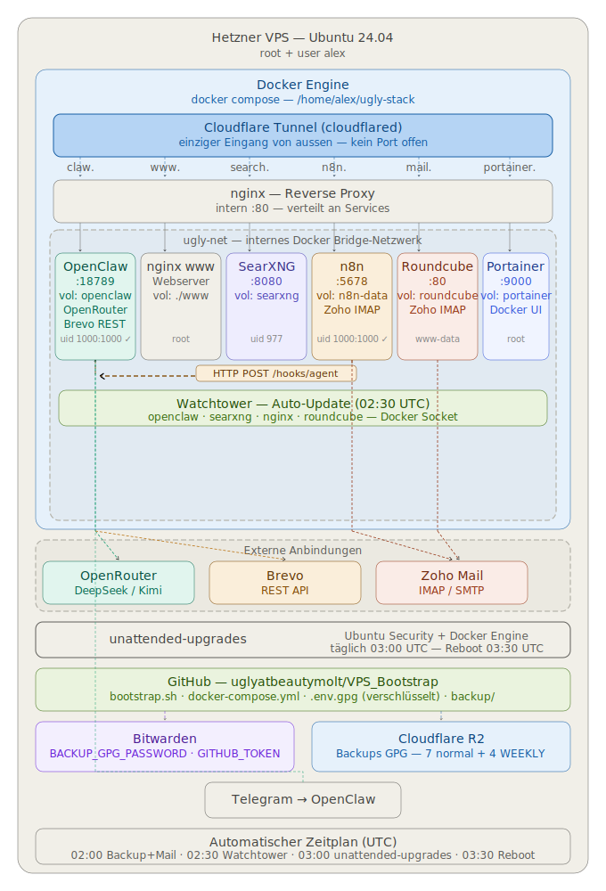

# Ugly Stack

> Persönlicher KI-Agent "Ugly" auf einem selbst gehosteten VPS — vollständig automatisiert, verschlüsselt gesichert und in wenigen Minuten wiederherstellbar.



## Services

| URL | Service |
|-----|---------|
| claw.beautymolt.com | OpenClaw (Ugly) |
| search.beautymolt.com | SearXNG |
| n8n.beautymolt.com | n8n |
| www.beautymolt.com | nginx Webserver |

## Schnellstart — Neuinstallation

```bash
# Als root auf frischem Ubuntu 24.04 VPS
curl -fsSL https://raw.githubusercontent.com/uglyatbeautymolt/VPS_Bootstrap/main/bootstrap.sh \
  -o bootstrap.sh
chmod +x bootstrap.sh
./bootstrap.sh
```

Das Script fragt nur nach:
1. Bitwarden E-Mail
2. Bitwarden Master-Passwort
3. Passwort für User `alex`

Alles andere kommt automatisch aus der verschlüsselten `.env.gpg` im Repo.
Neuestes Backup wird automatisch von Cloudflare R2 wiederhergestellt.

## Voraussetzungen

Folgende Secrets müssen in der **`.env`** hinterlegt sein (verschlüsselt als `.env.gpg` im Repo):

| Secret | Beschreibung |
|--------|-------------|
| `CLOUDFLARE_TUNNEL_TOKEN` | Tunnel Token |
| `OPENROUTER_API_KEY` | OpenRouter API Key |
| `TELEGRAM_BOT_TOKEN` | Telegram Bot Token |
| `OPENCLAW_GATEWAY_TOKEN` | OpenClaw Gateway Token |
| `N8N_BASIC_AUTH_USER` | n8n Benutzername |
| `N8N_BASIC_AUTH_PASSWORD` | n8n Passwort |
| `N8N_ENCRYPTION_KEY` | n8n Encryption Key (32 Zeichen) |
| `ZOHO_SMTP_USER` | Zoho Mail Login E-Mail |
| `ZOHO_SMTP_PASSWORD` | Zoho SMTP Passwort |
| `BREVO_SMTP_USER` | Brevo Login E-Mail |
| `BREVO_SMTP_API_KEY` | Brevo API Key (Versand) |
| `BACKUP_GPG_PASSWORD` | Passwort für Backup-Verschlüsselung |
| `CF_R2_ACCESS_KEY` | R2 Access Key |
| `CF_R2_SECRET_KEY` | R2 Secret Key |
| `CF_R2_BUCKET` | R2 Bucket Name |
| `CF_R2_ENDPOINT` | R2 Endpoint URL |

## Wichtige Befehle

```bash
cd ~/ugly-stack

# Secret aktualisieren (.env + Cloudflare gleichzeitig)
./set-secret.sh TELEGRAM_BOT_TOKEN "neuer-token"
./set-secret.sh                    # interaktiv

# Stack verwalten
docker compose ps
docker compose logs -f
docker compose restart
docker compose pull && docker compose up -d

# Container-Shell
docker exec -it openclaw bash
docker exec -it n8n sh

# Backup manuell
./backup/backup-master.sh

# Restore
./backup/restore/restore-master.sh list
./backup/restore/restore-master.sh
./backup/restore/restore-master.sh n8n
```

## Backup

- Täglich 03:00 automatisch via Cron
- GPG AES256 verschlüsselt → Cloudflare R2
- Letzte 7 Backups werden behalten
- OpenClaw: `openclaw backup create --verify` (eingebaut)
- n8n: Workflows + Credentials als JSON

## Dokumentation

Vollständiges Betriebshandbuch: **[BETRIEB.md](./BETRIEB.md)**

Neuen Container hinzufügen: **[backup/NEUES_MODUL.md](./backup/NEUES_MODUL.md)**

## Dateistruktur

```
~/ugly-stack/
├── bootstrap.sh              ← Neuinstallation
├── set-secret.sh             ← Secret aktualisieren
├── docker-compose.yml        ← Stack-Definition
├── architecture.svg          ← Architektur-Diagramm
├── README.md
├── BETRIEB.md                ← Betriebshandbuch
├── nginx/conf.d/
├── openclaw-data/            ← Volume
├── n8n-data/                 ← Volume
├── searxng-data/             ← Volume
├── www/                      ← Volume
└── backup/
    ├── backup-master.sh
    ├── modules/
    └── restore/
```
